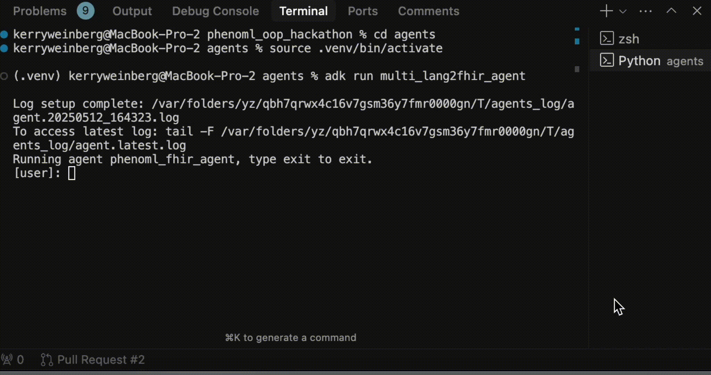

# PhenoML FHIR Agent

This agent provides tools for interacting with a FHIR server using PhenoML's lang2fhir API for natural language processing of healthcare data.

### Demo

Demo of an agent that you can build using this repo!



### OOP Hackathon Demo App
Check out [this fork](https://github.com/kerbearasaurus/phenoml_oop_hackathon) for Carely, the entire AI caregiver app we built during the OOP Hackathon: includes an agent built for EHR workflows powered by PhenoML, and task management with Todoist and Google Maps support! 

## Features

- Convert natural language descriptions to FHIR resources using PhenoML's lang2fhir API
- Convert natural language queries to FHIR search parameters
- Perform direct FHIR searches and resource creation on a FHIR server
- Automatically handle patient context for related resources

## Prerequisites

1. [PhenoML](https://developer.pheno.ml) account with access to the lang2fhir API
2. [Medplum](https://medplum.com) or [Canvas Medical](https://www.canvasmedical.com/emrs/developer-sandbox) account (or other FHIR server) for storing created resources and executing FHIR searches
3. Python 3.8+
4. Gemini API access: sign up for a Gemini API key [here](https://ai.google.dev/gemini-api/docs/api-key) 

## Setup

1. Clone this repository

2. Create your virtual environment
   ```bash
   python3 -m venv .venv
   ```

3. Activate (each new terminal) for macOS/Linux

   ```bash
   source .venv/bin/activate
   ```

4. Install dependencies
   ```bash
   pip install -r requirements.txt
   ```

5. Authenticate and set up environment variables:

   a. **Set .env credentials**:
   Open the file `agents/.env` in your text editor of choice and set your
PhenoML credentials and either Medplum or Canvas credentials based on which
EMR you have chosen.

   b. **Obtain PhenoML Token**:
   ```bash
   # Run the PhenoML authentication script with --save flag to save to .env automatically. Assumes your credentials are in your .env already 
   python3 auth/phenoml_auth.py --save
   ```

   c. **Obtain Medplum Token** (if using Medplum):
   ```bash
   # Run the Medplum authentication script with --save flag to save to .env automatically. Assumes your credentials are in your .env already
   python3 auth/medplum_auth.py --save

   ```

   d. **Obtain Canvas Token** (if using Canvas):
   ```bash
   # Run the Canvas authentication script with --save flag to save to .env automatically. Assumes your credentials are in your .env already
   python3 auth/canvas_auth.py --save

   ```

6. Run your agent! 
   ```bash
   adk run multi_lang2fhir_agent
   ```
You can also run your agent in a dev UI or spin up an api server. Check out google's ADK [quick start](https://google.github.io/adk-docs/get-started/quickstart/#run-your-agent)

## PhenoML lang2fhir API

This agent uses PhenoML's lang2fhir API, which provides:

- **Create endpoint**: Converts natural language to structured FHIR resources
- **Search endpoint**: Converts natural language to FHIR search parameters

For more information, visit: [PhenoML Documentation](https://developer.pheno.ml)

## License

[MIT](LICENSE) 
